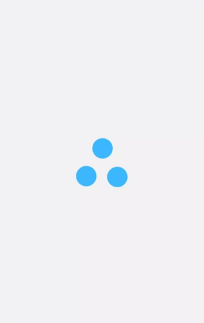

# lottie-loader-react-native

---

A React Native Loader Component which uses Airbnb's [Lottie](https://github.com/react-native-community/lottie-react-native) to render smooth and beautiful loading animations, without blocking the entire view.

 &nbsp;&nbsp;
 &nbsp;&nbsp;

### Installation

---

```
npm i -S lottie-loader-react-native
```

#### React Native CLI

If you're using React Native CLI you will need to link lottie-react-native to your package.
Click [here](https://github.com/react-native-community/lottie-react-native/blob/master/README.md#getting-started) for more information.

#### Expo

If you're using expo no extra step is required.

### Usage

---

```tsx
import React from "react";
import { StyleSheet, StyleProp, ViewStyle } from "react-native";
import { LottieLoader } from "lottie-loader-react-native";

interface LoadingProps {
  visible: boolean;
  animationStyle?: StyleProp<ViewStyle>;
}

export const Loading: React.FC<LoadingProps> = ({
  visible,
  animationStyle,
}) => {
  return (
    <LottieLoader
      visible={visible}
      source={require("./loader.json")}
      animationStyle={animationStyle}
      speed={1}
    />
  );
};

const styles = StyleSheet.create({
  lottie: { width: 100, height: 100 },
});
```

### Lottie Loader files

You can find free lottie files for your loaders [here](https://lottiefiles.com/search?q=loader).

## Props

| Prop                 | Description                                                                                                                                                                                                                                                     | Default                                              |
| -------------------- | --------------------------------------------------------------------------------------------------------------------------------------------------------------------------------------------------------------------------------------------------------------- | ---------------------------------------------------- |
| **`source`**         | The source of animation. Can be referenced as a local asset by a string, or remotely with an object with a `uri` property, or it can be an actual JS object of an animation, obtained (for example) with something like `require('../path/to/animation.json')`. | [Lottie Object](https://lottiefiles.com/1531-loader) |
| **`visible`**        | Controls the visibility of the loader.                                                                                                                                                                                                                          | `false`                                              |
| **`animationStyle`** | The style to be applied to the Lottie.                                                                                                                                                                                                                          | -                                                    |
| **`speed`**          | The speed the animation will progress.                                                                                                                                                                                                                          | `1`                                                  |
| **`loop`**           | A boolean flag indicating whether or not the animation should loop.                                                                                                                                                                                             | `true`                                               |

## License

Licensed under the [MIT](https://github.com/bocarw121/lottie-loader-react-native/blob/master/LICENSE).
